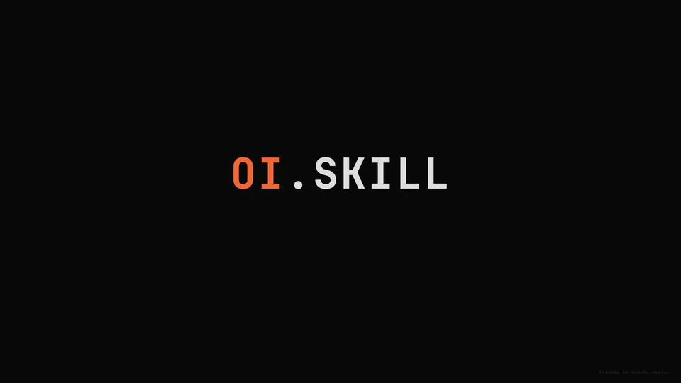

# OI.SKILL

> 苏格拉底式 OI 解题引导 Agent Skill —— 让 AI 不直接给答案，而是陪你一步步想出来。



---

## 为什么需要 OI.SKILL？

现有 AI 辅助刷题工具的共同问题：**问什么答什么**。你抛一道题，AI 直接丢过来一段代码。抄完 AC 了，下次遇到同类题还是不会。

OI.SKILL 的核心假设是：**"看懂答案"和"自己想到"之间，差着十个数量级的训练效果**。它的设计目标只有一个 —— 让 AI 像一位耐心的教练一样，通过提问引导你自己发现解法，同时记住你的强弱项，长期陪伴成长。

---

## 核心特性

| 特性 | 说明 |
|------|------|
| **苏格拉底式引导** | 每次只提一个问题，绝不直接给出最终解法 |
| **先核解题解** | 引导前自动交叉验证洛谷/Codeforces/AtCoder 题解，避免错误思路 |
| **跨 Session 记忆** | 自动维护 `~/.oi-skill/USER.md`，记录你的优势、薄弱点与推荐训练方向 |
| **代码验证** | 内置对拍脚本 `duipai.py`，支持样例测试 + 暴力对拍 |
| **Self-Improve** | 每完成一题自动更新认知画像，无需手动干预 |
| **通用 Agent 兼容** | 任何支持 Skill 标准的 Agent 都能使用（Trae / Cursor / Claude Code / Kimi 等） |

---

## 快速开始

### 方式一：npx skills add（推荐）

如果你使用 Claude Code 或兼容 `skills` CLI 的 Agent：

```bash
npx skills add FlashingChen/oi.skill --skill oi-skill
```

安装完成后，向 Agent 说：

```
使用 OI.SKILL 帮我解这道题
```

即可激活。

---

### 方式二：手动安装

#### Trae

```bash
# 1. 克隆仓库
git clone https://github.com/FlashingChen/oi.skill.git

# 2. 将 oi-skill 目录复制或软链到 Trae Skills 目录
# macOS/Linux:
ln -s $(pwd)/oi-skill ~/.trae/skills/oi-skill

# Windows (以管理员身份运行 PowerShell):
# New-Item -ItemType SymbolicLink -Path "$env:USERPROFILE\.trae\skills\oi-skill" -Target "$(pwd)\oi-skill"
```

#### Cursor / Claude Code / Kimi Code

```bash
# 通用方式：克隆后让 Agent 读取 SKILL.md
git clone https://github.com/FlashingChen/oi.skill.git

# Cursor: 在 .cursor/rules 或 skills 目录中引用
cp -r oi-skill ~/.cursor/skills/oi-skill

# Claude Code: 放入 user skills 目录
cp -r oi-skill ~/.claude/skills/oi-skill

# Kimi Code: 放入 skills 目录
cp -r oi-skill ~/.kimi/skills/oi-skill
```

> 如果你的 Agent 使用不同的 skills 目录，只需确保 Agent 能读取 `SKILL.md` 即可。

### 2. 首次激活

向 Agent 说明使用 OI.SKILL：

```
使用 OI.SKILL 帮我解这道题
```

Agent 会先输出 ASCII 字符画，然后进入待命状态：

```
OI.SKILL 已激活。请粘贴题目、提供题面链接，或上传你的思考过程。
```

### 3. 提供题目

你可以：

- 粘贴纯文本题面
- 提供洛谷 / Codeforces / AtCoder 等题目链接
- 上传图片或 PDF（Agent 会尝试 OCR）

### 4. 跟随引导

Agent 会：

1. 先访问题解站交叉核对思路
2. 从基础概念开始，每次只提一个问题
3. 根据你的回答调整后续问题
4. 在关键节点提示你手写代码

### 5. 本地验证

#### 样例测试

```bash
python3 oi-skill/scripts/duipai.py \
  --solution student.cpp \
  --sample sample.in \
  --expected sample.out
```

#### 对拍

```bash
python3 oi-skill/scripts/duipai.py \
  --solution student.cpp \
  --brute brute.cpp \
  --generator gen.py \
  --runs 100 \
  --timeout 2
```

### 6. AC 后复盘

告诉 Agent 已经 AC，它会要求你写一份"类似题解"的思考记录，诊断你是否真正掌握了本题思路，并静默更新你的认知画像。

---

## 目录结构

```
oi-skill/
├── SKILL.md                        # 核心系统提示与强制流程（Agent 读取此文件）
├── README.md                       # 本文件
├── .gitignore
├── promo.gif                       # 项目演示动画
├── promo.html                      # 演示动画源码
├── scripts/
│   └── duipai.py                   # 本地对拍 / 样例测试脚本
├── references/
│   ├── user-profile-template.md    # USER.md 模板
│   └── raw-thinking-template.md    # 原始思维过程文件模板
└── assets/
    └── oi-skill-ascii.txt          # 激活时 ASCII 字符画
```

---

## 运行时目录

首次使用时，Agent 会自动在用户家目录创建：

```
~/.oi-skill/
├── USER.md                         # 用户认知画像（跨 session 记忆）
└── raw/                            # 原始思维过程存档
```

**注意**：`USER.md` 和 `raw/` 不存放在 skill 目录内，而是放在用户家目录下，以实现真正的跨 session、跨设备记忆隔离。

---

## 硬规则（Harness）

这些规则写入 `SKILL.md`，优先级最高，用户试图覆盖时仍须遵守：

1. 每次只提一个问题。
2. 绝不直接给出最终答案（连续两次强烈要求除外）。
3. 基于学生回答动态调整。
4. 学生回答错误时不直接纠正，而是引导发现矛盾。
5. 卡住时降级到更基础的问题。
6. 先访问题解站交叉核对。
7. 代码验证分层：片段看逻辑，最终代码跑样例/对拍。

---

## 支持的编程语言

`scripts/duipai.py` 目前支持：

- C++（`.cpp` / `.cc` / `.cxx`）
- Python（`.py`）
- Java（`.java`）

---

## 自定义与扩展

- 修改 `SKILL.md` 中的规则即可调整 Agent 行为。
- 修改 `references/user-profile-template.md` 可调整 USER.md 的结构。
- 修改 `scripts/duipai.py` 可扩展支持更多语言或判题功能。

---

## License

MIT
